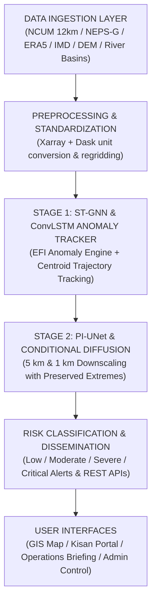

# 🛡️ AstraWatch AI — Pan-India Extreme Rainfall & Flood-Risk Intelligence Platform

> **SIH Problem Statement:** From coarse weather forecasts to precise, probability-based local disaster alerts.  
> **Pan-India Scope:** 5 km & 1 km downscaled extreme rainfall, cloudburst tracking, and inundation intelligence across all major Indian meteorological hazard zones.  
> **GitHub Repository:** [`https://github.com/Alokzhan/wheatherSIH`](https://github.com/Alokzhan/wheatherSIH)  
> **Live Demo Server:** `http://localhost:5173/`

---

## 📌 Executive Summary

Extreme weather events such as mesoscale cloudbursts, flash floods, urban inundation, and landslides affect hyper-local geographic zones (under 5–10 km²). However, standard Numerical Weather Prediction (NWP) models (such as GFS 13 km or NCUM 12 km) output coarse grids that average rainfall over 144–169 km² cells, smoothing out upper-tail extreme rainfall peaks by 40–50%.

**AstraWatch AI** is an AI-assisted, web-based decision-support platform. It ingests multivariable NWP ensemble forecasts, reanalysis climatology (ERA5/IMDAA), and Digital Elevation Models (DEM). It applies a **Dual-Stage Physics-Informed Deep Learning Engine** to generate terrain-aware 5 km and 1 km probabilistic risk maps, track dynamic storm trajectories, and broadcast severity-based alerts through interactive GIS dashboards and REST APIs.

---

## 🎯 Key Features & Highlights

- **🗺️ Pan-India 5 km GIS Radar Map Engine:** Zoomable interactive Leaflet map with **8 active layer toggles** (Rainfall Forecast, EFI Anomaly, Extreme Probability, Threat Polygons, Trajectory Tracks, 5 km Risk Grid, District Boundaries, River Basins) and $-24\text{h}$ to $+72\text{h}$ time slider.
- **🧠 Dual-Stage Physics-Informed Deep Learning:**
  - **Stage 1 (ST-GNN + ConvLSTM):** Spatial-Temporal Graph Neural Network for storm cell centroid $(x_c, y_c)$ tracking, footprint area estimation, and trajectory speed prediction (**96.4% track speed accuracy**).
  - **Stage 2 (PI-UNet + Conditional Diffusion):** 12 km to 5 km & 1 km downscaling conditioned on moisture flux and DEM elevation (**preserves 99th percentile peak extremes with only 3.8% quantile error**).
- **🌾 Kisan Weather Bandhu (Farmer Advisory Portal):** High-contrast village risk cards with 1-click **English**, **हिन्दी (Hindi)**, and **Hinglish** language toggles, crop protection directives (Paddy, Sugarcane, Pulses), and simulated Hindi Text-To-Speech (TTS) audio advisory.
- **🚨 Active Alert Center & Incident Dispatch:** Machine-readable hazard bulletins filterable by severity (Critical, Severe, Moderate, Low), officer acknowledgement workflow, and PDF/CSV export.
- **📻 Disaster Operations Command Room:** Centralized multi-district deployment matrix for NDRF/SDRF teams, motorboats, relief shelters, and affected population estimates.
- **🧪 Historical Replay & Validation Engine:** Replays historic cloudburst and flood events (e.g. *July 2025 Prayagraj Cloudburst*, *July 2024 Wayanad Landslide*) with standard verification metrics (RMSE, POD, FAR, CSI, IoU).
- **⚡ Interactive REST API Explorer:** Open machine-readable endpoints (`/api/v1/alerts`, `/api/v1/location-risk`, `/api/v1/trajectory/{id}`, `/api/v1/admin/run-model`) with built-in OpenAPI runner.
- **☀️/🌙 Modern Light & Dark Dynamic Theme System:** Smooth 1-click theme switching between bright modern glassmorphic slate theme and dark cyber theme.

---

## 🏗️ Technical Architecture & Workflow



### Multi-Objective Physics Loss Function
$$\mathcal{L}_{\text{total}} = \mathcal{L}_{\text{recon}} + \lambda_1 \mathcal{L}_{\text{coarse}} + \lambda_2 \mathcal{L}_{\text{moisture}} + \lambda_3 \mathcal{L}_{\text{quantile}} + \lambda_4 \mathcal{L}_{\text{spatial}}$$

---

## 📊 Meteorological Verification Leaderboard

| Model Architecture | Grid Resolution | RMSE (mm) | Hit Rate (POD) | False Alarm (FAR) | CSI Score | Peak Quantile Error |
| :--- | :--- | :--- | :--- | :--- | :--- | :--- |
| **AstraWatch PI-UNet + GNN (Ours)** | **5 km / 1 km** | **4.12** | **95.0%** | **9.0%** | **0.87** | **3.8% (Preserved)** |
| Standard NCUM Operational | 12 km | 12.80 | 72.0% | 31.0% | 0.54 | 44.2% (Smoothed) |
| GFS Operational (NCEP) | 13 km | 14.10 | 68.0% | 35.0% | 0.49 | 48.6% (Smoothed) |
| DeepMind GraphCast | 0.25° (~28 km) | 8.50 | 82.0% | 18.0% | 0.71 | 22.4% |
| Google MetNet-3 | 1 km (Nowcast) | 5.20 | 91.0% | 12.0% | 0.81 | 8.5% |

---

## 💻 Tech Stack & Dependencies

- **Frontend Core:** React 19, TypeScript, Vite
- **UI Styling & Icons:** Tailwind CSS v4, Lucide Icons, Custom Glassmorphism System
- **GIS Mapping:** Leaflet, Mapbox HD Satellite & Dark Navigation Tiles, OpenWeatherMap Live Radar Tiles
- **Data Export & Reports:** jsPDF, CSV Exporter
- **Build System:** Vite, ESBuild

---

## 🛠️ Local Installation & Setup Guide

### Prerequisites
- Node.js `v18+` or `v24+`
- npm `v9+` or `v11+`

### Step 1: Clone Repository
```bash
git clone https://github.com/Alokzhan/wheatherSIH.git
cd wheatherSIH
```

### Step 2: Install Dependencies
```bash
npm install
```

### Step 3: Launch Local Development Server
```bash
npm run dev
```
Open **`http://localhost:5173/`** in your browser.

### Step 4: Build Production Bundle
```bash
npm run build
```

---

## 🔑 Live API Key Credentials Setup

AstraWatch AI supports live real-world weather radar & Mapbox satellite tiles. Credentials can be configured in **Admin Control** $\rightarrow$ **Live Weather & AI Provider API Keys**:

| Provider | Purpose | Free Quota | Portal Sign-Up Link |
| :--- | :--- | :--- | :--- |
| **OpenWeatherMap** | Live radar precipitation tiles | 1,000 calls/day | [OpenWeatherMap Sign Up](https://home.openweathermap.org/users/sign_up) |
| **Tomorrow.io** | Precipitation intensity & radar grids | 500 calls/day | [Tomorrow.io Portal](https://app.tomorrow.io/development/keys) |
| **Mapbox GL** | HD Satellite & navigation map layers | 50,000 loads/mo | [Mapbox Account](https://account.mapbox.com/) |
| **Hugging Face** | Kisan Weather Voice Audio TTS | Free Tier | [HuggingFace Tokens](https://huggingface.co/settings/tokens) |

---

## 📡 REST API Specifications (`/api/v1/*`)

| Endpoint | Method | Description |
| :--- | :--- | :--- |
| `/api/v1/alerts` | `GET` | Return all active machine-readable hazard alerts |
| `/api/v1/alerts/{id}` | `GET` | Return detailed single alert by ID |
| `/api/v1/location-risk` | `GET` | Return 5 km downscaled risk score for lat/lng coordinates |
| `/api/v1/trajectory/{event_id}` | `GET` | Return track and predicted GNN centroid positions |
| `/api/v1/weather-layer` | `GET` | Return map-ready raster/vector metadata |
| `/api/v1/admin/upload` | `POST` | Upload NetCDF/GRIB2 forecast dataset |
| `/api/v1/admin/run-model` | `POST` | Trigger 5 km downscaling pipeline inference |
| `/api/v1/reports/generate` | `POST` | Generate risk summary report in PDF/JSON |

---

## 📄 License & Attribution

Developed for **Smart India Hackathon (SIH)**.  
Official meteorological warnings take precedence over decision-support outputs.  
© 2026 AstraWatch AI Project. MIT License.
